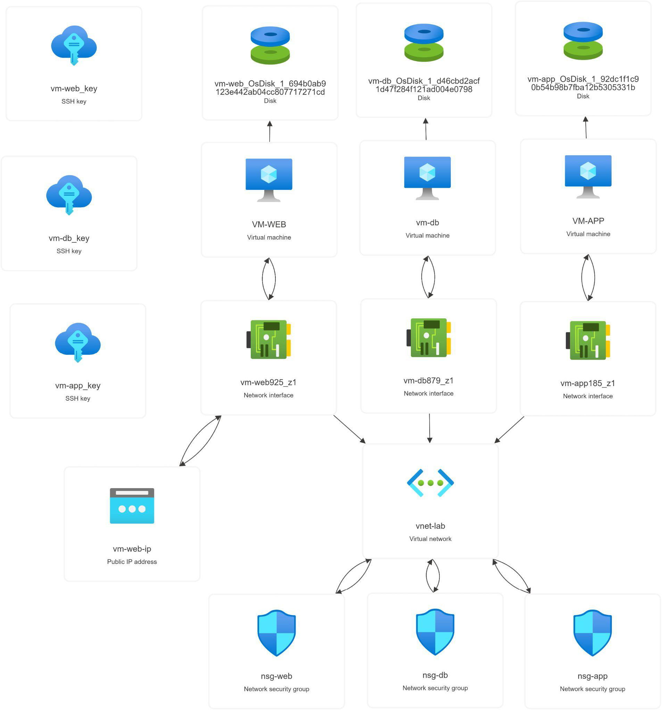
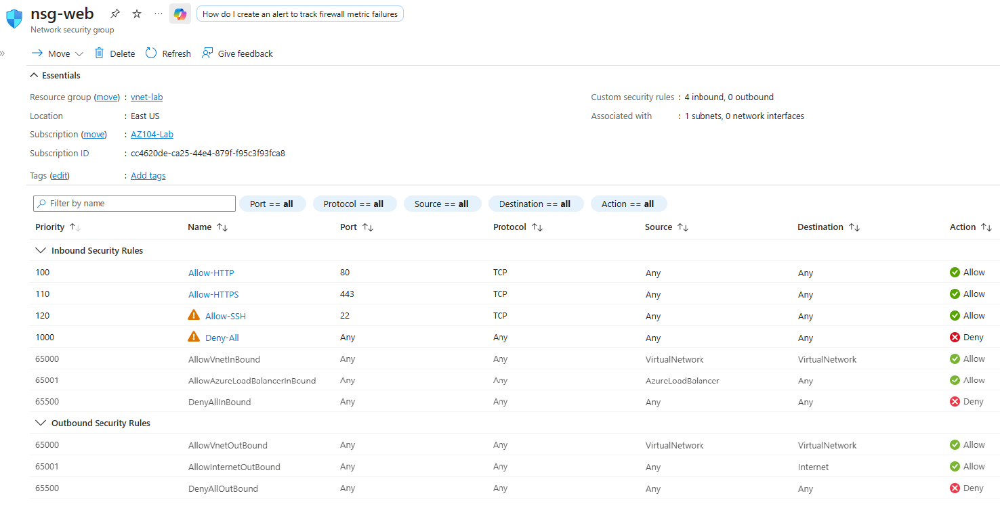
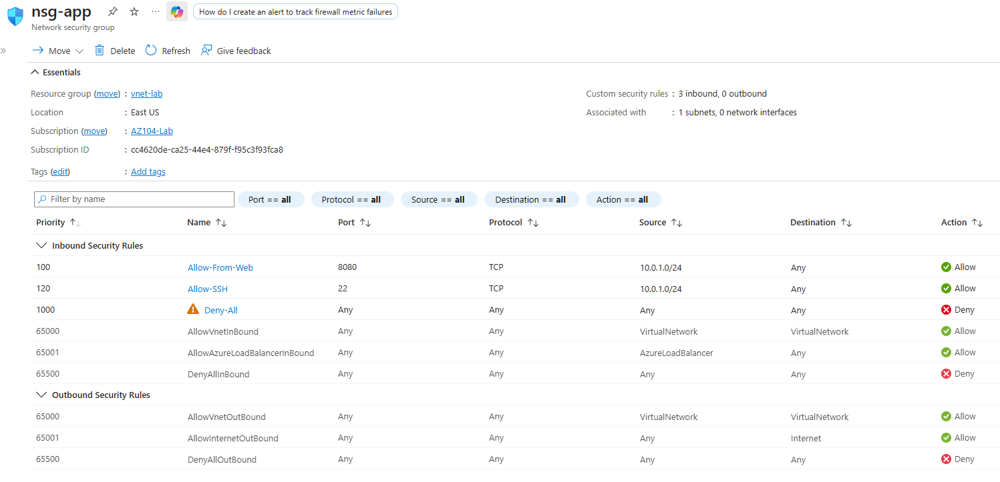
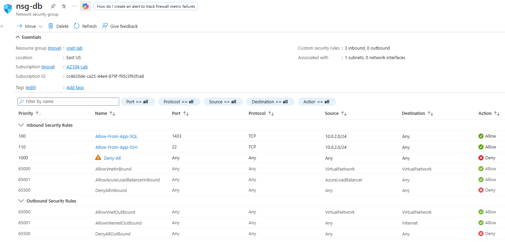
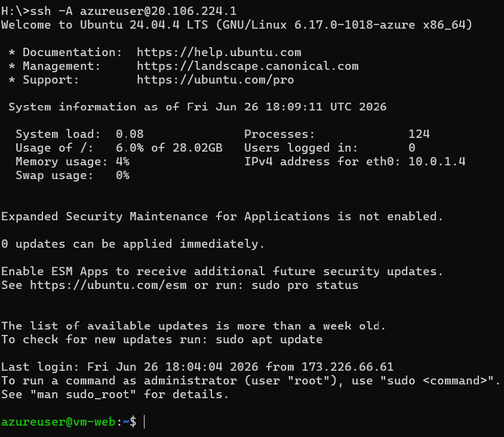
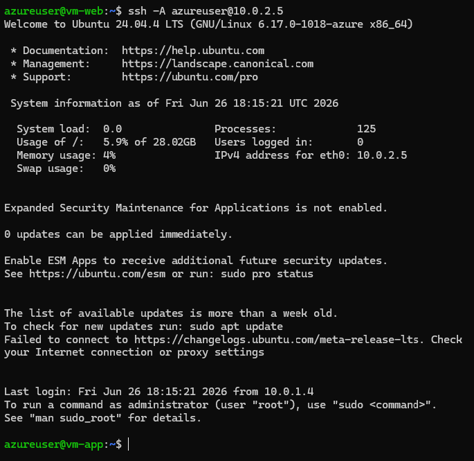
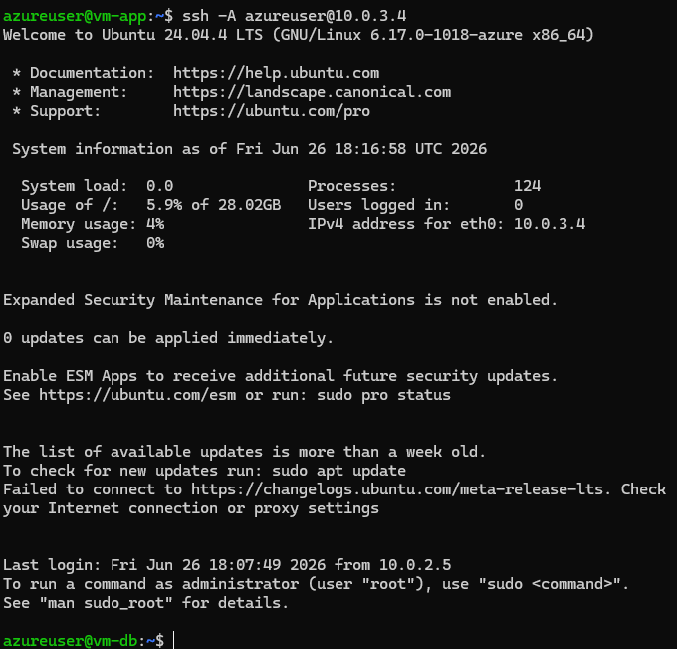
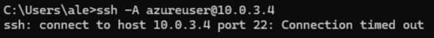
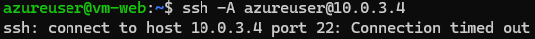

# Three-Tier Azure Network Segmentation Lab

## Overview

A zero-trust network architecture demonstrating deny-by-default NSG segmentation across three tiers (web, app, database). This lab reflects secure network patterns required by federal contractors and government agencies.

**Key Achievement:** Validated end-to-end SSH jumpbox chain with complete traffic isolation—public internet can reach only the web tier; backend tiers are entirely inaccessible from outside.

## Architecture

**Three Subnets:**
- `subnet-web` (10.0.1.0/24) — Internet-facing layer with public IP
- `subnet-app` (10.0.2.0/24) — Application logic, reachable only from web tier
- `subnet-db` (10.0.3.0/24) — Database, reachable only from app tier

## Security Rules (Deny-by-Default)

Each tier is governed by its own NSG with explicit allow rules and a deny-all fallback.

### nsg-web

### nsg-app

### nsg-db

## Validation & Testing

### Allowed Traffic

**Internet → vm-web**

**vm-web → vm-app**

**vm-app → vm-db**

### Blocked Traffic (Negative Tests)

**Internet → vm-db (Denied)**

**vm-web → vm-db (Denied)**

## Resources Deployed

- Virtual Network: `vnet-lab` (10.0.0.0/16)
- 3x Ubuntu 24.04 LTS VMs
- 3x Network Security Groups (nsg-web, nsg-app, nsg-db)
- 3x SSH Key Pairs
- 1x Public IP (attached to vm-web only)

## Next Steps

**Planned:** Terraform IaC version with automated deployment, state management, and reusability for multi-environment rollout.
